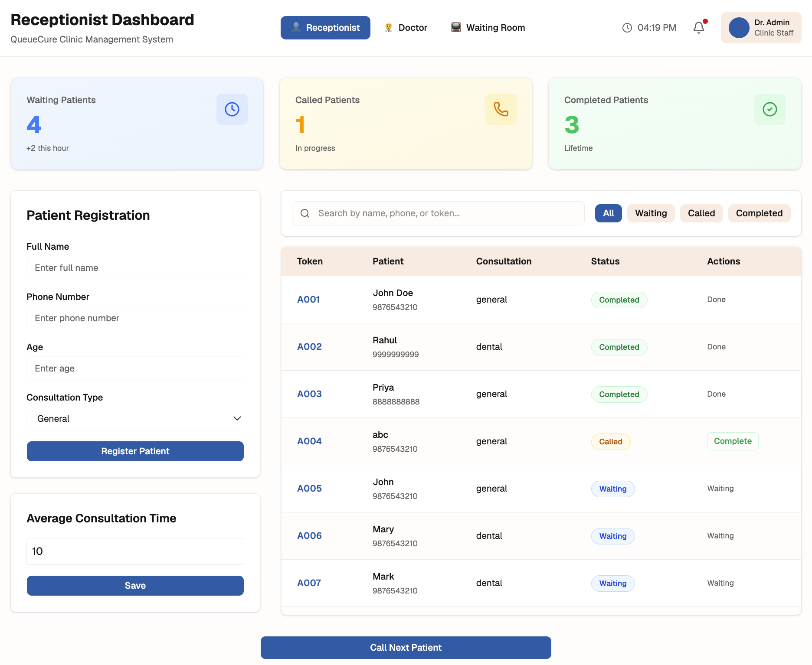
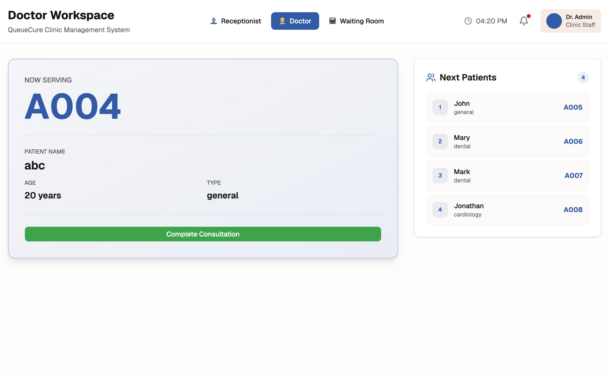
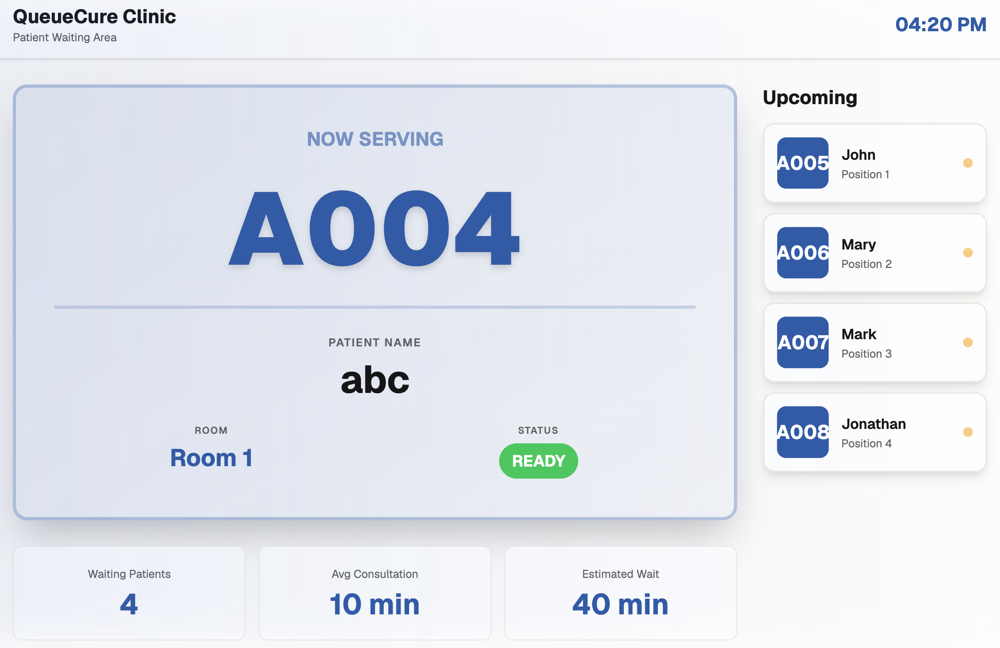

# QueueCure

QueueCure is a real-time clinic queue management platform designed to streamline patient flow and improve communication between receptionists, doctors, and patients.

## Live Demo

Frontend:
https://queue-cure-one.vercel.app/

Backend:
https://queuecure-backend-600h.onrender.com

---

## Problem

Many small clinics still manage queues manually, causing:

- Uncertainty about whose turn is next
- Frequent interruptions at reception
- Lack of visibility for doctors
- Poor waiting-room experience

QueueCure solves this by providing a centralized real-time queue system that keeps all stakeholders synchronized.

---

## Features

### Receptionist Dashboard

- Register new patients
- Generate queue tokens automatically
- View all patients
- Search and filter patients
- Call next patient
- Track queue status

### Doctor Workspace

- View currently called patient
- See upcoming queue
- Complete consultations
- Monitor queue progress

### Patient Waiting Room Display

- Live "Now Serving" screen
- Upcoming queue display
- Waiting statistics
- Estimated waiting time

### Real-Time Synchronization

- Socket.IO powered updates
- No manual refresh required
- Instant queue updates across all screens

---

## Tech Stack

### Frontend

- Next.js
- React
- TypeScript
- Tailwind CSS
- React Query
- Axios

### Backend

- Express.js
- MongoDB
- Mongoose
- Socket.IO
- Zod

### Deployment

- Vercel (Frontend)
- Render (Backend)

---

## Architecture

Receptionist Dashboard
↓
Express API
↓
MongoDB
↓
Socket.IO Events
↓
Doctor Dashboard + Waiting Room Display

---

## Project Structure

```
QueueCure/
├── frontend/
│   ├── app/
│   ├── components/
│   ├── hooks/
│   └── services/
│
├── backend/
│   ├── controllers/
│   ├── routes/
│   ├── services/
│   ├── models/
│   └── config/
│
└── docs/
```

---

## Screenshots

### Receptionist Dashboard



### Doctor Workspace



### Waiting Room Display



### Receptionist Dashboard

Manage registrations and queue operations.

### Doctor Workspace

Monitor active consultations and queue flow.

### Waiting Room Display

Public screen showing current and upcoming patients.

---

## Future Improvements

- Role-based authentication
- Appointment scheduling
- Historical analytics
- Smarter wait-time prediction
- Multi-clinic support

---

## Author

Bhavya Shrivastava

B.Tech Chemical Engineering, IIT (BHU) Varanasi

GitHub:
https://github.com/bhavya8823